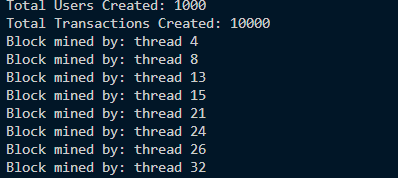
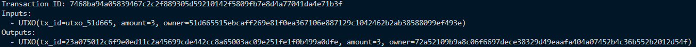
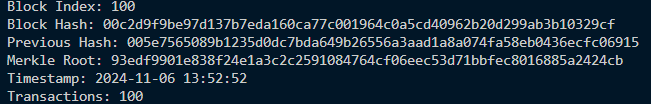

# Blockchain Simulation

This project simulates a blockchain in c++ using a UTXO transaction model and multithreaded block mining and a user-defined difficulty level for mining.

## Table of Contents
- [Installation](#installation)
- [Overview](#overview)
- [Usage](#usage)
  - [Generate Users and Initial UTXOs](#generate-users-and-initial-utxos)
  - [Add Transactions](#add-transactions)
  - [Mine Pending Transactions](#mine-pending-transactions)
  - [Print Specific Transactions and Blocks](#print-specific-transactions-and-blocks)
- [Functions](#functions)
  - [print_transaction](#print_transaction)
  - [print_block](#print_block)
- [Example_Outputs](#example)

## Installation
1. Clone or download this repository.
2. Ensure a c++ compiler of version c++17 or above is installed on your machine. Guide on how to do that here: https://sajidifti.medium.com/how-to-install-gcc-and-gdb-on-windows-using-msys2-tutorial-0fceb7e66454
3. Install any necessary libraries if needed.
4. Open cmd and navigate to the folder containing this project.
5. Type: `g++ *.cpp -o main.exe -std=c++17`.
6. Type: `./main.exe` to launch the executable file.

## Overview
This blockchain simulation has the following classes:

- **UTXO**: Represents an unspent transaction output, keeping track of a unique ID, amount, owner, and a boolean spent flag.
- **Transaction**: Holds inputs and outputs of UTXO's for a transaction and generates a unique transaction ID, also holds a boolean valid flag.
- **Block**: Holds transactions, holds the mining function, merkle tree and a timestamp.
- **Blockchain**: Manages the chain of blocks, pending transactions,candidate transaction blocks, initiates mining, UTXO pool, and difficulty settings.
- **User**: Represents a user with a public key.

## Usage
This blockchain allows you to:

- Generate users with initial UTXO's.
- Add users and transactions manually.
- Generate transactions between users.
- Launch the blockchain to process all pending transactions.
- Print transaction and block details for verification and exploration.

### Generate Users and Initial UTXOs
In the main function, `generate_users(blockchain, num_users)` creates user objects with a unique public key and adds initial UTXOs to the `utxo_pool` for each user.

### Add users and transactions manually
In the main function, calling the `make_transaction(user1, user2, amount, blockchain)` function lets you make a simplified transaction not using the UTXO's as inputs.

### Generate Transactions
Use the `generate_transactions(users, num_transactions)` function to generate transactions between users, with random amounts based on available UTXOs.

Each transaction is added to the blockchain using `blockchain.add_transaction(transaction)`. Only valid transactions are added.

### Mine Pending Transactions
To process and secure the pending transactions in a new block, call: `blockchain.Launch()`

This starts the process of each thread taking a separate candidate block and mining until a valid hash is found for one of the blocks. Then the blocks which were not mined are cleared and their transactions returned to the pending transactions vector. This process repeats until all pending transactions have been processed

### Print Specific Transactions and Blocks
  The <b>print_transaction</b> function in <b>Transaction</b> and <b>print_block</b> function in <b>Blockchain</b> allow you to view details of any specific transaction or block.
## Functions

### print_transaction

Usage: Prints the details of a transaction, including its ID, UTXO inputs, and UTXO outputs.

### print_block
Usage: Prints details of a specified block, including its hash, previous hash, merkle root, timestamp, and the number of transactions contained within it.

## Example
### Multithreading overview in the process of mining blocks

### Printing Transaction details

### Printing last block details

